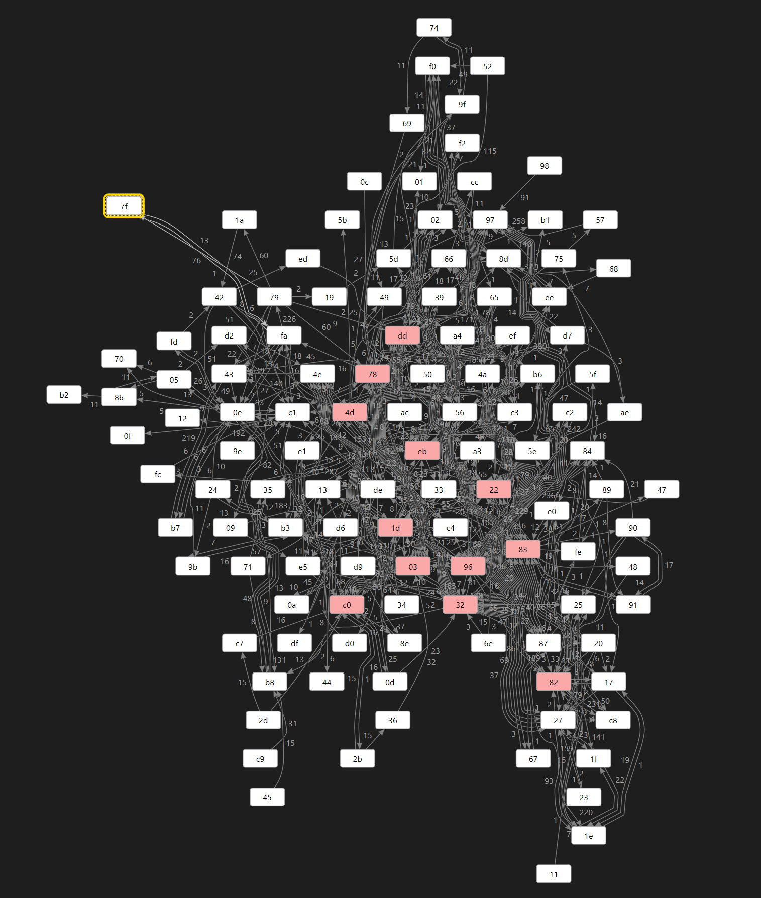

Generates a map of meshcore traffic based on what is seen from mqtt observers uploading to letsmesh.net.



Step 1: snapshot recent packet routes (adjust the `region` parameter for where you live):
```
curl.exe -v -H "Accept: */*" --user-agent "Mozilla/5.0 (Windows NT 10.0; Win64; x64) AppleWebKit/537.36 (KHTML, like Gecko) Chrome/143.0.0.0 Safari/537.36 Edg/143.0.0.0" "https://api.letsmesh.net/api/packets/filtered?region=LAX%2COXR%2CSAN&type=Advert&limit=1000" -o filtered.json
```
Step 2: analyze

Commands:
* `dgml`: dumps a DGML file to standard out
  * Example: `dotnet run -- filtered1.json filtered2.json --dgml > nodes.dgml`
  * View DGML in Visual Studio or https://marketplace.visualstudio.com/items?itemName=coderAllan.vscode-dgmlviewer
* `route [from hex] [to hex]`: finds a route between two repeaters
  * Example: `dotnet run -- filtered1.json filtered2.json --route 7f 66` -> `7f,fa,79,78,66`
  * Example: `dotnet run -- filtered1.json filtered2.json --route 66 7f` -> `66,56,78,fa,7f`
